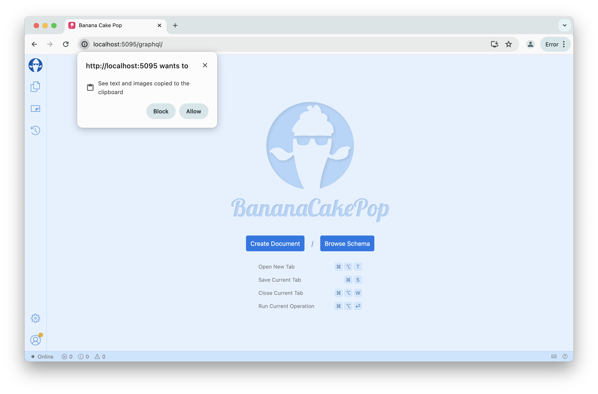
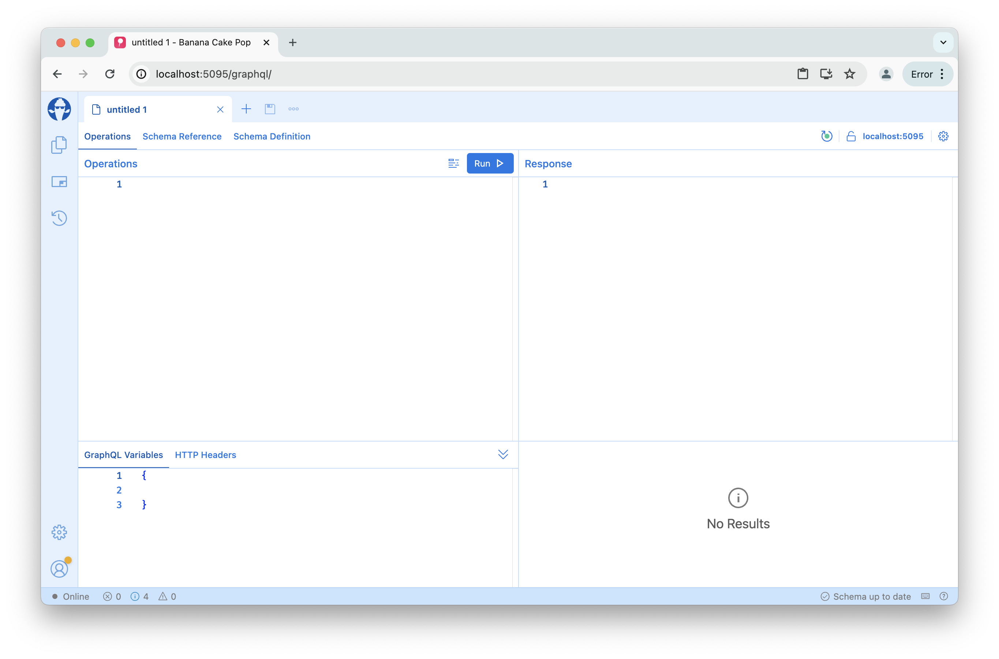
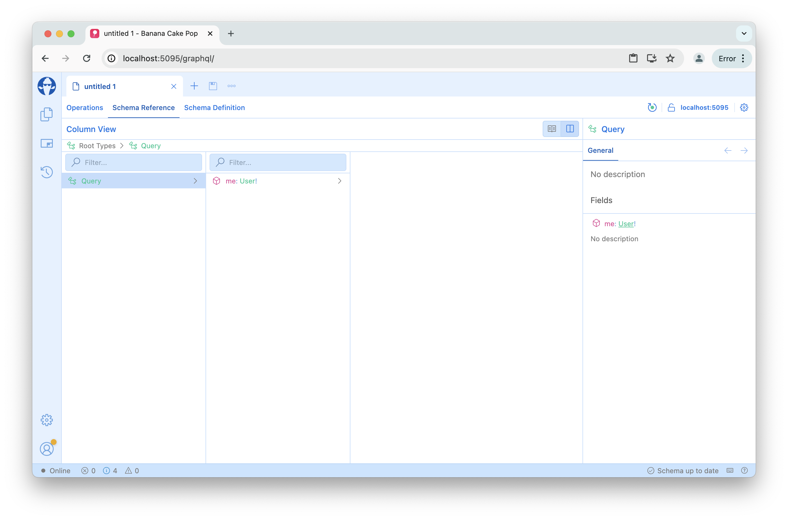

# First Query

In this lesson, we will focus on the basic GraphQL operation syntax to fetch data from our GraphQL server.

## Start the Demo GraphQL Server

First, let's go to the lesson directory.

```bash
cd src/Chapter1/Lesson1/Begin
```

Next, we will start the demo GraphQL server.

```bash
dotnet run
```

By default, the GraphQL server will listen on port 5095. Per the GraphQL over HTTP spec, a GraphQL server will by default listen on the `/graphql` endpoint. Open your web browser and enter the following address: `http://localhost:5095/graphql/`

Our GraphQL IDE, Banana Cake Pop, will show up and allow you to explore the schema and write GraphQL requests.

If you open Banana Cake Pop for the first time, you will see a small popup that asks you if it is allowed to access the clipboard. This is needed to copy GraphQL requests from the Google Chrome developer tools.



Allow this for this workshop as we will later use this feature to inspect requests we are making against our frontend.

Next, click on the Create Document button to open a new document that will allow you to explore the schema.



Before we start, head over to the `Schema Reference` tab and take a look at the schema.

There are two views available: the `Type View` and the `Column View`. The `Type View` shows the schema in a documentation style, whereas the `Column View` allows you to explore the schema along the query path.



## Tasks

1. Explore the schema in the Schema Reference tab.
1. Switch to the Column View and explore the schema along the query path.
1. Write your first query to get the currently signed in user's name.
1. On the user's news feed, what is the second comment on the first post?
1. Who wrote the first comment on the second post?
1. What is the first story of the second friend of the currently signed in user?

## Summary

In this lesson, we have taken our initial steps into the realm of GraphQL. We executed our first queries and delved into some basic query characteristics. Additionally, we explored the ChilliCream GraphQL IDE, Banana Cake Pop, which comes bundled with the Hot Chocolate server.
