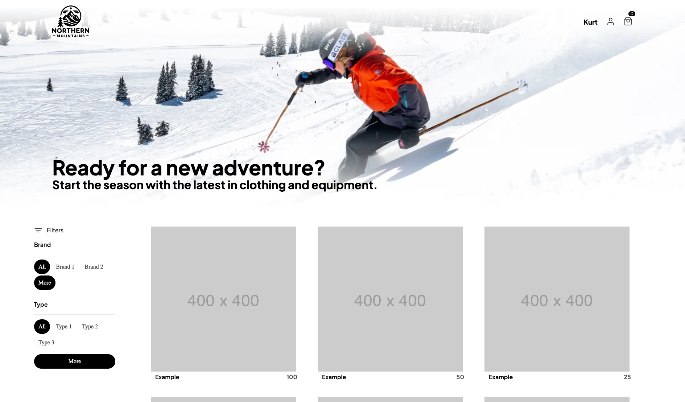

# Getting Started with Relay.js

## Introduction
Welcome to the beginning of our journey into integrating Relay.js with a React application for a
dynamic webshop front end. Relay.js is a powerful framework that works with GraphQL to efficiently
manage and fetch data. In this chapter, we'll lay the groundwork for this technology, enabling you
to create a responsive and scalable e-commerce platform.

## Learning Objectives
By the end of this lesson, you will be able to:
- Run the project
- Execute basic queries using the `useLazyLoadQuery` hook.
- Understand the role of the Relay compiler in a React project.

## Preparations

### Environment Setup
Before we dive into coding, let's set up our development environment to ensure everything runs
smoothly through subsequent lessons.

1. **Open the Project Folder:**
   Launch your code editor with the project directory:
   ```bash
   code src/Chapter5/Lesson1/Begin
   ```

2. **Install Dependencies:**
   Open a terminal in your code editor, navigate to the folder `src/Chapter5/Lesson1/Begin/`, and install the necessary packages:
   ```bash
   npm install
   ```

3. **Start the Application:**
   Once the installation is complete, start your React application:
   ```bash
   npm start
   ```

4. **Verify Installation:**
   Open your web browser and go to [http://localhost:5173/](http://localhost:5173/) to view the eShop app. You should see the initial setup of your webshop as shown below:

   

5. Start the GraphQL from Chapter 4.

## What is Relay.js and why should I use it?

Relay is a JavaScript framework for building data-driven React applications. 
It is designed to be scalable, performant, and easy to use. 
Its an opinionated framework that helps you to build applications that are easy to maintain and scale.
The design philosophy of Relay is to make the natural way of writing components the most efficient way to write components.
This framework is tested at scale by a billon users and prooven to be a good choice for large scale applications.


## Executing Your First Query with Relay.js

From our previous chapter, you've learned the basics of interacting with a GraphQL server. 
Initially, we used simple POST requests to fetch data. 
Now, we'll leverage Relay.js to optimize and streamline this process.

### Defining a GraphQL Query
Let's start by defining a GraphQL query that we'll use to fetch product data from our server. 
Assume we have already set up a catalog API in the previous chapter.

So first we define the query we want to send to the server. 
You can open banana cake pop to explore the schema and build the query.

```graphql
query catalogQuery {
  products {
    nodes {
      id
      name
      description
      price
    }
  }
}
```

### Fetching Data with `useLazyLoadQuery`
Relay.js simplifies data fetching in React applications using hooks like `useLazyLoadQuery`. 
This hook allows you to execute a query and handle the response seamlessly within your React components.

The easiest way to fetch data in relay is to use the `useLazyLoadQuery` hook.
This hook takes a query and some variables and returns the data from the server. 

A graphql query is defined in a `graphql` template literal directly in the component you want to use it.
In a template literal you can write code in a different language than the surrounding code. In this case, GraphQL in a JavaScript file.
Using a template literal allows the editor to provide syntax highlighting and autocompletion for the query. The query is **Co-located** with the component that uses it. 

To start simple, we want to just fetch the data in the `Products` component in the `/app/components/catalog/catalog.tsx` file.

```ts
const data = useLazyLoadQuery(
  graphql`
    query catalogQuery {
      products {
        nodes {
          id
          name
          description
          price
        }
      }
    }
  `,
  {}
);
```

The type of `data` is `unknown` at this point, and we can't access the fields we want to display in the component.

## Relay Compiler

Relay isn't just about sending simple queries directly to a server. it's about building robust, scalable applications. Typically, your queries won't be straightforward but composed of multiple fragments. 
Here’s where the Relay compiler comes into plays.

### What Does the Relay Compiler Do?
The compiler analyzes your code to extract queries, fragments, mutations, and subscriptions from the
template literals. It composes these fragments into complete queries and generates a new file. This
file contains the meta data of your queries in a format ready for Relay to fetch data efficiently.

Beyond organizing your queries, the compiler also generates TypeScript or Flow types. These types
can be used within your components to ensure type safety across your server and client code. 

### Conventions and Rules
Relay is an opinionated framework designed for large-scale applications, enforcing certain conventions:

- **Queries**: Should be named as `<fileName>Query`
- **Mutations**: Should be named as `<fileName>Mutation`
- **Subscriptions**: Should be named as `<fileName>Subscription`
- **Fragments**: Naming convention of `<componentName>_<typeName>` is recommended (not enforced)

### Running the Compiler

To compile your project and prepare everything for Relay to fetch, run:
```bash
npm run relay
```
This command processes your GraphQL template literals and outputs the necessary files into the
`/__generated__` folder.

After running the relay compiler, we can import the generated types in our component and use them to access the data.

Once the Relay compiler has done its job, you can import the generated types into your components to
interact with the data more securely and efficiently. For instance, in `catalog.tsx`, use the types
to specify the data structure for the `useLazyLoadQuery` hook:
```typescript
const data = useLazyLoadQuery<catalogQuery>(
  // Query omitted for brevity
);
```

### Example: Displaying Products
With the types and queries in place, accessing and displaying data becomes straightforward:
```typescript
function Products(props: ProductsProps) {
  const data = useLazyLoadQuery<catalogQuery>(
    graphql`
      query catalogQuery {
        products {
          nodes {
            id
            name
            description
            price
          }
        }
      }
    `,
    {}
  );

  return (
    <div className="catalog-items">
      {data.products?.nodes?.map((product) => (
        <CatalogListItem
          id={product.id}
          name={product.name}
          price={product.price}
          imageUrl="https://via.placeholder.com/400"
        />
      ))}
    </div>
  );
}
```

## Tasks

1. **Initial Setup and Data Fetching**: Follow the steps outlined in this lesson to set up your React and Relay environment. Verify that you can fetch and display data from the server on your application.
1. Rename the query in the `catalog.tsx` file to `catalogLookup` and run the Relay compiler and observe the behavior.
1. **Implementing Filters:** In the provided application, on the left side, you'll find placeholders for brand and category filters. Your task is to create and execute a GraphQL query that fetches brands and categories from the server. Integrate this data into the filters located at `/app/components/catalog/catalog-search.tsx`