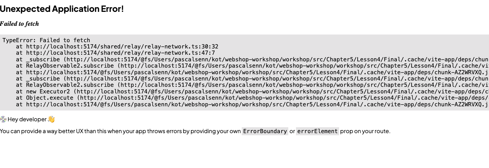

# Loading and Error States

## Introduction
In the previews lesson, we learned how to use arguments in our queries to filter the data we fetch. During the introduction of the filters, we noticed that the application flickers when we change the brand. In this lesson, we will learn how to complete the user experience by adding loading and error states to our application.

## Learning Objectives
By the end of this lesson, you will be able to:
- Understand how component suspense works in relay
- How to handle errors in queries

## Preparations

Continue directly from where we left off in the last lesson or start fresh with the initial setup in the `src/Chapter6/Lesson1/Begin` folder.

Run `npm install` in the `src/Chapter6/Lesson1/Begin/` folder to install the necessary packages.

## Recap

:::info[Solutions from the last lesson]

1. -
1. - 
1. yes, the `defaultValue` is used.
1. - 
1. That we will cover in this lesson.


:::

You've likely noticed the flicker when changing the brand in the filters, especially on a slow 3G network connection. 

One important detail about the `useLazyLoadQuery` hook is that it doesn't directly handle loading or error states. 
Instead, Relay leverages React Suspense for loading states and error boundaries for error handling.

## Suspense a component
Our application already incorporates a Suspense boundary near its root. If you explore the React dev tools and suspend the catalog, you'll see that the header and footer remain visible while the catalog is loading.

Any component using `useLazyLoadQuery` can throw a promise that React Suspense will catch. 
However, it's not just `useLazyLoadQuery` that can trigger a suspense; any component using a fragment can also suspend individually.

When you adjust the product filter, Relay identifies which fragments are affected by the change and only invalidates their data. Consequently, the `Products` component will enter a suspended state, but the filters will not.

By adding a Suspense boundary to `catalog.tsx`, the promise thrown by the `useFragment` hook in `<Products />` gets caught earlier, allowing the filters to remain visible. 
Remember to set the `fetchPolicy` to `store-and-network` in the `useLazyLoadQuery` hook within the `catalog.tsx` file to optimize data fetching. (We will soon understand why this is required.)

```tsx
  return (
    <>
      <div className="catalog">
        <CatalogSearch
          selectedBrandId={brandId}
          selectedTypeId={typeId}
          onBrandChange={setBrandId}
          onTypeChange={setTypeId}
          $ref={data}
        />
        <div>
          <Suspense>
            <Products typeId={typeId} brandId={brandId} $ref={data} />
          </Suspense>
        </div>
      </div>
    </>
  );
```


## Error 
Our application is now more robust when switching brands. However, what happens if the server encounters an error?

To test this scenario, you can simulate a server failure by stopping your server and reloading the page. When you do this, the application will display an error screen, which is not user-friendly. Moreover, the error page you see in development might not even appear in a production environment.



Errors are inevitable, and we must handle them gracefully.  For our purposes, we will use the `ErrorBoundary` component available in the utils folder. 

Let's encapsulate the `<Outlet />` in `Layout.tsx` with the `ErrorBoundary` component from the utils folder and observe the behavior when an error occurs.

Relay utilizes React's error boundaries to manage errors thrown by the `useLazyLoadQuery` hook. 
While we won't dive deep into error boundaries here, you can learn more about them in the [React documentation](https://react.dev/reference/react/Component#catching-rendering-errors-with-an-error-boundary).
In Relay, there are several strategies to retry queries after an error. You can explore these patterns further in the [Relay documentation](https://relay.dev/docs/guided-tour/rendering/error-states/).  

## Tasks
1. Try to follow the steps outlined in this lesson
1. Try to simulate an error and observe the behavior.
1. Are there any other places in the application where we should add error boundaries?
1. Do you notice something about the graphql request we do, when we change the brand?  Do you know why this happens?


