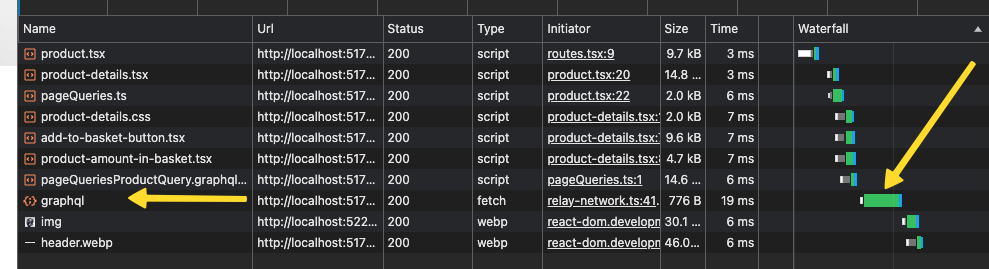
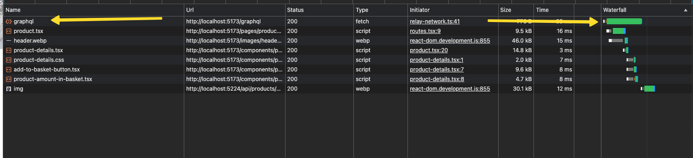

# Fetching Patterns 

## Introduction
After a quick exploration of the Relay store, we will have a look into advanced fetching patterns in Relay. In this lesson, we will optimize our fetching strategy to be more efficient.

## Learning Objectives
By the end of this lesson, you will be able to:
- Preload a query
- Understand how and why preloading is important

## Preparations

Continue directly from where we left off in the last lesson or start fresh with the initial setup in the `src/Chapter7/Lesson2/Begin` folder.

Run `npm install` in the `src/Chapter7/Lesson2/Begin/` folder to install the necessary packages.

## Recap

:::info[Solutions from the last lesson]
1. -
1. -
1. The query should not be sent to the server as it is already in the store.
:::

Currently, we use the `useLazyLoadQuery` hook to fetch data for the `Catalog` component when it mounts. Fetching data right when the component mounts isn't usually the best strategy in a React application. It's better to start fetching data as early as possible to reduce the use of loading spinners.

If we need to wait to fetch the component and we need to wait for the data to be fetch, we should whenever to the waiting concurrently.

## Preloading Queries
Upon selecting a product from the catalog, users are directed to the product detail page, which presently does not initiate any data fetch. 
Given our existing knowledge, we can easily add the query in the `pages/product.tsx` using the `useLazyLoadQuery` hook and wire it up to the component.

If we navigate from the catalog to a product, the data fetches on demand. This works well, but we can still improve it. If you clear the network tab on the catalog page and then go to a product, you'll see that the data only requests after all the JavaScript files have loaded. This happens because we need to mount the component before Relay starts fetching the data.



In theory, we could start fetching data for the product detail page as soon as you click on a product in the catalog. This is where preloading comes into play.

## Prerequisites for Preloading
In Relay, you can preload queries using the `useQueryLoader` hook or the `loadQuery` function. Preloading is effective when you don't load all the JavaScript at once. Most modern bundlers automatically split code, which means they divide the JavaScript into multiple chunks that load as needed.

For preloading to be effective, the query you want to preload must be in the main bundle that loads initially. If it’s not, you'll have to load the query first before you can execute it.

Code splitting is a complex topic, and we won’t cover it in detail here. In React, you typically use the `React.lazy` function to handle code splitting for imports, as demonstrated in the `routes.tsx` file.

Although different bundlers have various methods to optimize how chunks are handled, the simplest way to ensure a query is in the main bundle is to import it directly. However, we don't want the entire `product.tsx` code in the main bundle. So, we separate the query into its own file, `product-page-query.ts`, to manage this efficiently.

## The Router
The router controls which page appears in our application. In this workshop, we are using the `react-router-dom` package. Not all routers automatically support preloading, but React Router enables it through the `loader` property on routes.

Another increasingly popular router is Next.js, which has built-in support for server-side rendering and preloading. Next.js introduces some unique challenges to Relay integration, which we will not delve into during this workshop. You can find a working example of Relay with Next.js in the [Relay Next.js example](https://github.com/sibelius/relay-workshop/tree/main/apps).

## Preloading the Query
When a user decides to visit the product detail page, we need to preload the data using `loadQuery`. First, import the necessary query and `loadQuery` function from Relay, then invoke this function in the `loader` prop of the route as shown below:

```tsx filename=src/routes.tsx
{
    id: "product",
    element: <ProductPage />,
    path: "product/:id",
    loader: ({ params }) => {
        if (!params.id) {
        return loadQuery(environment, productQuery, { id: params.id });
        }
        return null;
    },
},
```

Now, every time a user navigates to a product, Relay immediately starts fetching the data.

## Consuming the Preloaded Query
In `app/product.tsx`, we need to use the query that we've already preloaded. 
This involves two main steps. First, we obtain a reference to the preloaded query. We do this using the `useLoaderData` hook from React Router, which gives us the value returned by the `loader` function in the routes file. Then, we pass this reference to the `usePreloadedQuery` hook from Relay.

```ts
  const ref = useLoaderData() as any;
  const data = usePreloadedQuery<productPageQuery>(query, ref);
```

Now, if we open the catalog, clear the network tab, and navigate to a product, we will see that the data is fetched immediately, without having to load the JavaScript files first.



## Conclusion
Interestingly, Relay was originally designed to function as a router. The concept of preloading and efficiently delivering JavaScript was a fundamental goal for the Relay team. Although Relay is no longer considered a router, some routing concepts are still integral to its design. However, these concepts are not widely documented. You can learn more about entry points in the Relay documentation here: [Glossary](https://relay.dev/docs/glossary/#entrypoint) or [Entry Points](https://relay.dev/docs/api-reference/use-entrypoint-loader/).

This version maintains the essence of your original text while ensuring that the process and terminology are clear and accessible.

## Tasks
- Try to follow the steps outlined in this lesson
- Is there a way to preload the query in the catalog page as well?
- Which query should be preloaded?
- How could we improve this even more?
